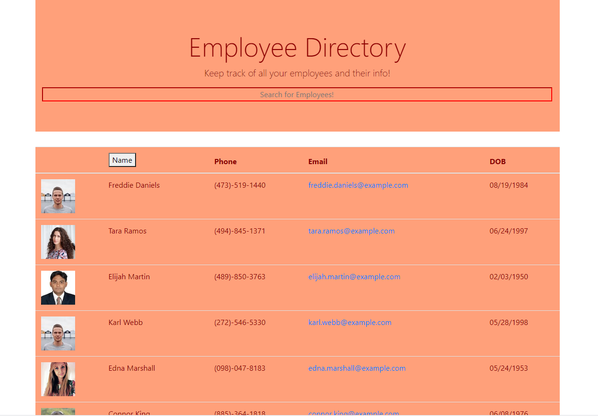

# Employee Directory
  
   
  

  ## Description

  In this app, the user will be able to dynamically search for any employeee. Using the search bar at the top of the page, the user will search for any employee they want to view. As theyre typing, all employess name who match the input will appear while the user is searching. 
  
  Website: https://reactemployeedirectory-mo.herokuapp.com/

  
  
  ## Table of Contents
  * [Installation](#installation)
  * [Usage](#usage)
  * [Contribution](#contribution)
  * [License](#license)
  ## Installation
  
  App is deployed to heroku. No need to install unless you want to improve the application. If you wish to contrinute clone the repo and run npm install.
  
  
  ## Usage
  
  Follow prompts on the browser. See description for more info.
  
  
  ## Contribution
  
  Anyone can contribute to this project to improve functionality and UI
  
  
  ## License
  
  MIT License
  
  
  ## Questions?
  
  If you have any questions, please contact me with the information below:

  Github [@oballematt](https://github.com/oballematt)
  
